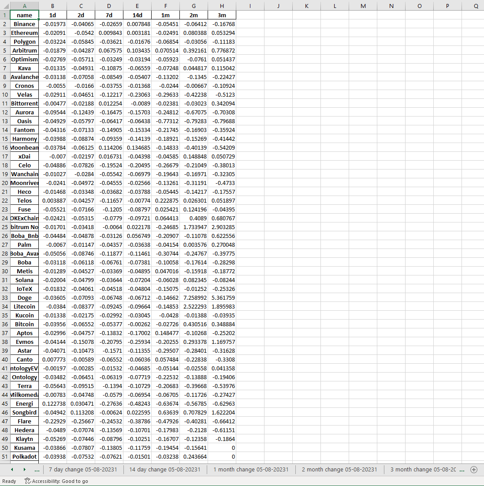

# Blockchain TVL Tracker

This project makes use of the [DefiLlama API](https://defillama.com/docs/api) and uses the API to pull the $ value of the total value locked of each blockchain that DefiLlama tracks. The code then calculates the percent change in the TVL of each chain for 1 day, 2 days, 1 week, 2 weeks, 1 months, 2 months, and 3 months. The resulting calculation is then shown in a final dataframe, as well as seperate dataframes for each calculation. Finally the code writes the data to an excel file so that each day as its tracked you can congregate all the data in one spot. The excel file will look something like this:

---
